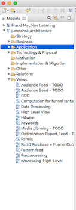
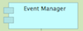
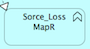
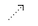
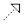
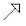
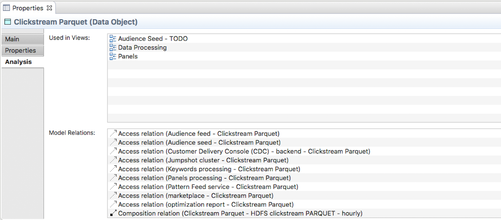

# Jumpshot Backend Architecture documentation
This repository holds architecture model reflecting actual jumpshot component eco-system. It describes which applications are running to process incoming 
clickstream data together with data structures created on the way. The content of the model is focused on backend components (applications) and data structures. 
Other elements (technical infrastructure, web application, proprietary tools used by other teams etc.) are covered just for illustration to give a picture on potential dependencies.

**Online (html) version** of the model is available [here](http://wiki-dev.int.jumpshot.com). On the left side of the page you can click on Views and see list of diagrams
showing particular parts of the Jumpshot architecture. The first one to select should be *High Level View*. From there you can get to details by clicking on 
shadow boxed within the blue components.

Notation for the model is _Archimate v3, application layer_ - a standard for documenting enterprise IT architecture. The main reason for using this standard is to define common standard
for expressing relations between jumpshot components involved in data processing. Formalism is very simple to cover only aspects, which need to be expressed. Users and contributors 
should get into the problematics very quickly without studying any heavy standard specification. Definition of the _Archimate_ standard used can be found 
[here](http://pubs.opengroup.org/architecture/archimate3-doc/chap09.html).

## Table of content
 * [Table of content](#table-of-content)
  * [Collaboration and tools](#collaboration-and-tools)
    + [Opening the model](#opening-model)
    + [Model structure](#model-structure)
    + [Archimate elements used](#archimate-elements-used)
    + [Archimate relationships](#archimate-relationships)
    + [Searching for dependencies](#searching-for-dependencies)
    + [Updating the model](#updating-the-model)
    + [Model Content](#model-content)
  * [GIT repository](#git-repository)

## Collaboration and tools
### Opening model
Model is stored in _archimate_ format. There is handful which can be used for Archimate modelling, the preferred one is *Archi*
an opensource product available for Linux, Mac and Windows. You can download it [here](https://www.archimatetool.com). In this repo, you can find model content in _jumpshot_architecture.archimate_ in 
the folder `archimate_model/`. To open it using _Archi_ do the following:
1. do GIT pull from *https://git.int.jumpshot.com/engineering/docs/Backend_Architecture*
2. run _Archi_ and select *File->Open
3. browse to your local image of the repository and open `archimate_model/jumpshot_architecture.archimate`
### Model structure
Model is organized in kind of folder structure which can be seen on the left side window in _Archi_. As mentioned above we use _Application_ layer, so the relevant master folder is _Application_.

There you can see a structure reflecting logical grouping of jumpsjots' avasts' components. In lower levels you can see further substructures towards a particular application level. These folders
contain components taking partin during jumpshot processing, to create a nice picture reflecting how they are connected you need to browse into _Views_ folder where these pictures are placed. 
Using the components in the _Application_ directory you can do as many different views as you want. Generally its a good idea to work top-down from the details point of view 
(that's how jumpshot architecture views are organised). The hierarchy of views is the following:
1. *High Level View*  - reflecting data from Avast towards our target components (S3, Insights App). When you click on the grey boxes within blue components you will be linked towards lower level views.
2. *Preprocessing/Processing-High-Level* - showing high level communication between core components.
3. Architecture of each particular application which is the lowest level of the model.

### Archimate elements used
There is just couple of elements from the _Archimate v3_ standard used in the model. We wanted to make it simple and easy readable even for people not familiar with enterprise architecture modeling
standards. Overall we use the following types of components:

1. *Application component* - used for representation of application/platform or Azkaban project responsible for executing certain actions on data. 
    
2. *Application function* - representing spark/mapReduce jobs fired by application components towards our YARN cluster. Can be used for generally any sub-job launched by an _Application component\- 
3. *Data object* - used for any data persistence we use in Jumpshot - HDFS files (e.q. cliskstream, patternFeed data, etc.), Mongo DB (e.q. CDC configuration, funnel cube data for APP), 
    PostgreSQL (used for audience seeding), Hive tables etc. 

in case some more _Archimace_ elements should be used to reflect better some now hidden aspects of the model, they can be simply added.

### Archimate relationships
To reflect how data flows between components _Archimate relations_ are used. again there is quite a few on them in the _Archimate v3_ standard. For the model purposes we have selected the following ones:
1. *Access relation*  - reflects that certain _Application component_ or _Application function_ accesses certain _Data object_. Types of this can be _Read_ _Write_ or _Read/Write_.
    
2. *Realization relation* - points that an _Application component_ does certain _Application function_ - for example _CDC backend service_ realizes _CDC spark jobs_ to 
    prepare data for Jumpshot customers. 
3. *Assignment relation* - used for spark/MapR jobs and YARN cluster - means that certain spark/MapR _Application function_ is executed on a YARN cluster.
    
4. *Aggregation relation* - used to express relations between _Data objects_ when one is an aggregate of another.
    
5. *Specialization relation* - when a _Data object_ is contains a sub-set of another _Data object_ content.
    
6. *Composition relation* - reflect that a _data object_ has been created with data from more than one another _data objects_.
    
7. *Flow relation* - generic data flow between elements - used for REST API call for instance.
    

### Searching for dependencies
In case you need to find which components are connected to the one you are looking at, there is a table named _Analysis_ on _Properties_ panel. Normally
you can see it on the bottom of the _Archi_ or html export window.

### Updating the model
As mentioned above, model is stored in _archimate_ format in the file `archimate_model/jumpshot_architecture.archimate`. To open it in _Archi_ go to 
*File->Open* and browse to your local copy of the git repository. After you are finished with your changes you can simply
push into master branch of the repo. We decided not to implement any heavy branching model because no real collaboration at one moment is expected. After
the push a git pipeline is executed and your changes are after a while propagated as an html report [here](http://wiki-dev.int.jumpshot.com).

### Model Content
The most important information model holds is the picture reflecting data flow between components. On the other hand there is some more information about
each element which may be interesting for reading audience and can be found in _properties_ in the bottom of the _Archi_ and html export;
* *Application component*:
    * responsible person
    * GIT repository
    * link to documentation (in case there is something on top of GIT)
* *Data object*:
    * responsible person
    * link to documentation
    * path (in case its relevant - hdfs/filesystem)
    
## GIT repository
Model content is stored in GIT repository to enable collaboration. There is no strict rule on doing changes, simply pull the master, do what you need to do and push. 
Html export will be automatically updated and your changes immediately visible to others using _Archi_. GIT pipeline for model html export is using _Archi_ 
commandline feature which is included in the _Model Repository Collaboration Plugin_ available on _Archi_ [page](https://www.archimatetool.com/plugins). Html
export feature uses GTK library which needs some XServer in order to be able to do proper formatting. To enable this you need to install the following packages
on GIT CI/CD executor:
* gtk3
* xvfb - fake XServer

execution of the html export the looks as follows:

>Xvfb :99 &&
> 
>export DISPLAY=:99
>
>Archi -application com.archimatetool.commandline.app -consoleLog -nosplash --xmlexchange.import ... --html.createReport ...
>
>pkill -f 'Xvfb :99'